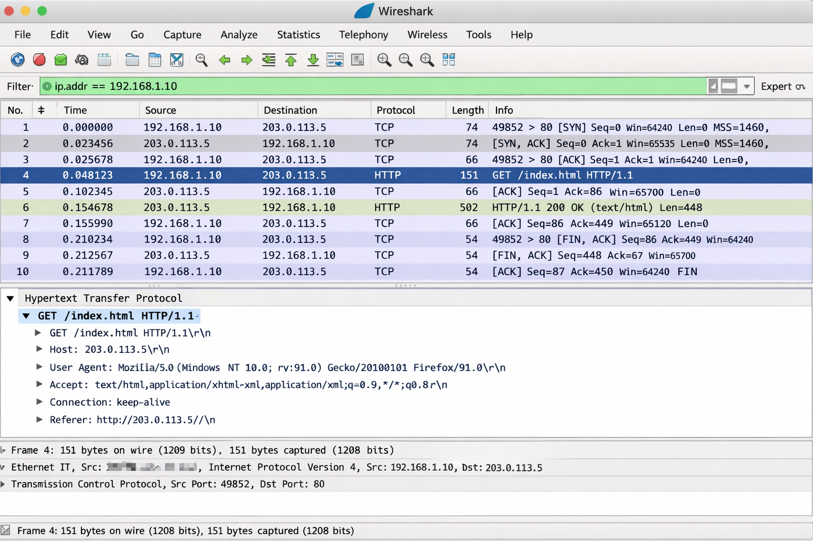

# network学习笔记
> —康思晟

## 一、网络模型初识

### 1. 网络前世今生

计算机网络的发展大致经历了从单机时代到局域网（LAN），再到广域网（WAN），最终发展为全球互联的互联网（Internet）。
最初计算机之间通过简单的串口通信或专线连接，后来随着以太网技术的出现，局域网开始普及。
1980 年代，基于 ARPANET 的技术基础，互联网逐渐形成，并采用了 Internet Engineering Task Force 推动制定的 TCP/IP 协议体系。

随着 Web 技术兴起，尤其是 Tim Berners-Lee 提出万维网概念后，互联网开始广泛进入大众生活。

------

### 2. 网络模型基本概念

为了方便理解复杂的网络通信过程，人们提出了“分层模型”的思想。

最经典的是 OSI 七层模型（理论模型），以及实际应用最广泛的 TCP/IP 四层模型。

OSI 七层（自下而上）：

1. 物理层
2. 数据链路层
3. 网络层
4. 传输层
5. 会话层
6. 表示层
7. 应用层

TCP/IP 四层：

1. 网络接口层
2. 网络层
3. 传输层
4. 应用层

分层的好处：

- 降低复杂度
- 各层职责清晰
- 易于维护与扩展

------

## 二、TCP/IP 初识

### 1. TCP 的特点

TCP（Transmission Control Protocol）是面向连接的、可靠的传输协议，属于传输层协议。

主要特点：

- 面向连接（三次握手）
- 可靠传输（确认机制、重传机制）
- 有序传输（序列号）
- 流量控制（滑动窗口）
- 拥塞控制（避免网络拥堵）

TCP 适用于对数据完整性要求高的场景，例如网页浏览、文件下载等。

------

### 2. TCP 报文结构

TCP 报文段主要包括：

- 源端口号
- 目的端口号
- 序列号（Sequence Number）
- 确认号（Acknowledgment Number）
- 首部长度
- 控制位（SYN、ACK、FIN、RST 等）
- 窗口大小
- 校验和
- 紧急指针
- 数据部分

其中：

- SYN：用于建立连接
- ACK：确认
- FIN：释放连接

------

### 3. TCP 建立连接和释放连接的过程

#### （1）三次握手 —— 建立连接

1. 客户端发送 SYN 报文
2. 服务器返回 SYN + ACK 报文
3. 客户端发送 ACK 报文

这样双方确认收发能力正常，连接建立。

------

#### （2）四次挥手 —— 释放连接

1. 客户端发送 FIN
2. 服务器返回 ACK
3. 服务器发送 FIN
4. 客户端返回 ACK

连接正式关闭。

------

## 三、HTTP 初识

### 1. HTTP 报文结构

HTTP 是应用层协议，基于 TCP 传输。

HTTP 请求报文结构：

- 请求行（方法 + URL + 版本）
- 请求头（Headers）
- 空行
- 请求体（可选）

HTTP 响应报文结构：

- 状态行（版本 + 状态码 + 状态描述）
- 响应头
- 空行
- 响应体

常见方法：

- GET（获取资源）
- POST（提交数据）
- PUT（更新资源）
- DELETE（删除资源）

------

### 2. HTTP 状态码的含义

状态码分为五类：

1xx —— 信息
 2xx —— 成功

- 200 OK（请求成功）

3xx —— 重定向

- 301 永久重定向
- 302 临时重定向

4xx —— 客户端错误

- 400 Bad Request
- 403 Forbidden
- 404 Not Found

5xx —— 服务器错误

- 500 Internal Server Error
- 502 Bad Gateway

------

### 3. HTTP 请求/响应过程

当用户在浏览器输入网址：

1. 浏览器解析 URL
2. 进行 DNS 解析
3. 建立 TCP 连接（三次握手）
4. 发送 HTTP 请求
5. 服务器处理请求
6. 返回 HTTP 响应
7. 浏览器解析并渲染页面
8. 关闭 TCP 连接（四次挥手）

整个过程体现了分层模型的协作：

- 应用层：HTTP
- 传输层：TCP
- 网络层：IP
- 链路层：数据传输

